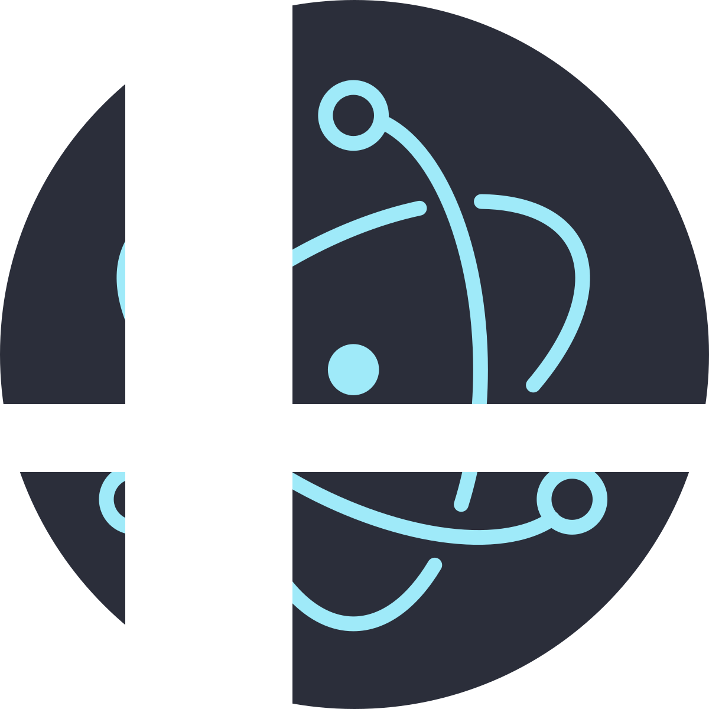

  

# SSBM Nucleus

Mod manager for Super Smash Bros. Melee. Download, organize, and install character and stage skins.

**Download:** [ssbmnucleus.net](https://ssbmnucleus.net) — the app auto-updates after install.

**Wiki & guides:** [ssbmnucleus.net/wiki](https://ssbmnucleus.net/wiki/index.html)

**Discord:** [Join](https://discord.gg/JeSy7Erv)

This repository is the public home for **releases, issues, and documentation**. The application source is not published here — see [Source](#source) below.

## Features

- One-click skin downloads from the website
- Visual vault for organizing mods, CSPs, and stock icons
- Automatic CSP generation from DAT files
- Netplay safety validation
- Batch install skins
- Skin creator with live paint, texture import/export, and 3D preview
- Extras system — edit sword trails, lasers, shine, thunder, shadow ball, and other character-specific effects
- Pose manager — create and batch generate custom CSP poses
- Embedded 3D model and animation viewer
- Auto-generate Dolphin texture packs for unlimited skins per ISO
- Mod bundles (.ssbm) — one-click xdelta patches + texture packs
- XDelta patch creation for sharing modpacks
- First-run setup with auto-detection of Slippi and Melee ISO

## Requirements

- Windows 10/11 (64-bit)
- A legally obtained copy of Super Smash Bros. Melee (NTSC 1.02, `GALE01`)

SSBM Nucleus ships **no Nintendo game data**. On first run it extracts what it needs from the ISO you provide, on your machine. No game assets are distributed with the installer.

## Reporting bugs

Open an [issue](../../issues). Bug reports are much easier to act on with:

- the app version (Help → About, or the installer filename)
- what you were doing when it broke
- the log file — Help → Open Logs Folder

## Credits

Built with [MexManager](https://github.com/Ploaj/MexManager), [HSDRawViewer](https://github.com/Ploaj/HSDLib), and [Costume Validator](https://ssbmtextures.com/other-mod-types/costume-validator-by-ploaj/) by Ploaj

Built on the [MEX system](https://github.com/akaneia/m-ex) and Dynamic Alternate Stages by UnclePunch

## Source

SSBM Nucleus is free to use but is **not open source**. Development happens in a private repository, and this repo carries no application code.

Third-party components and their licenses are listed in [THIRD_PARTY_NOTICES.md](THIRD_PARTY_NOTICES.md). Versions published under the MIT license before this change remain MIT for anyone who already has them.

## Not affiliated with Nintendo

Super Smash Bros. Melee is a trademark of Nintendo. This project is an independent, non-commercial modding tool and is not affiliated with, endorsed by, or sponsored by Nintendo or HAL Laboratory.
